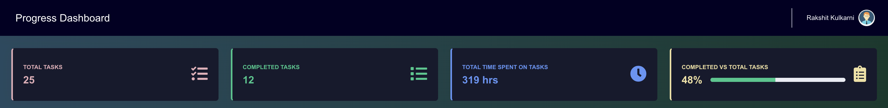
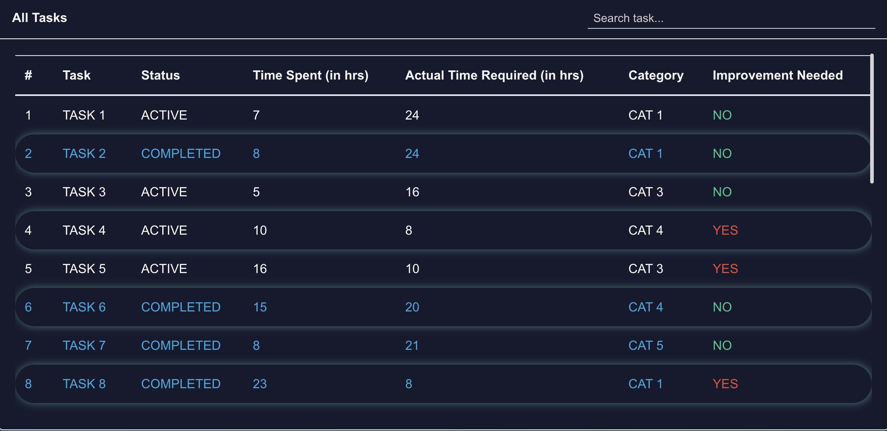
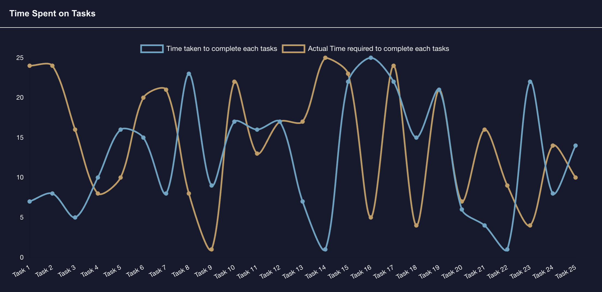
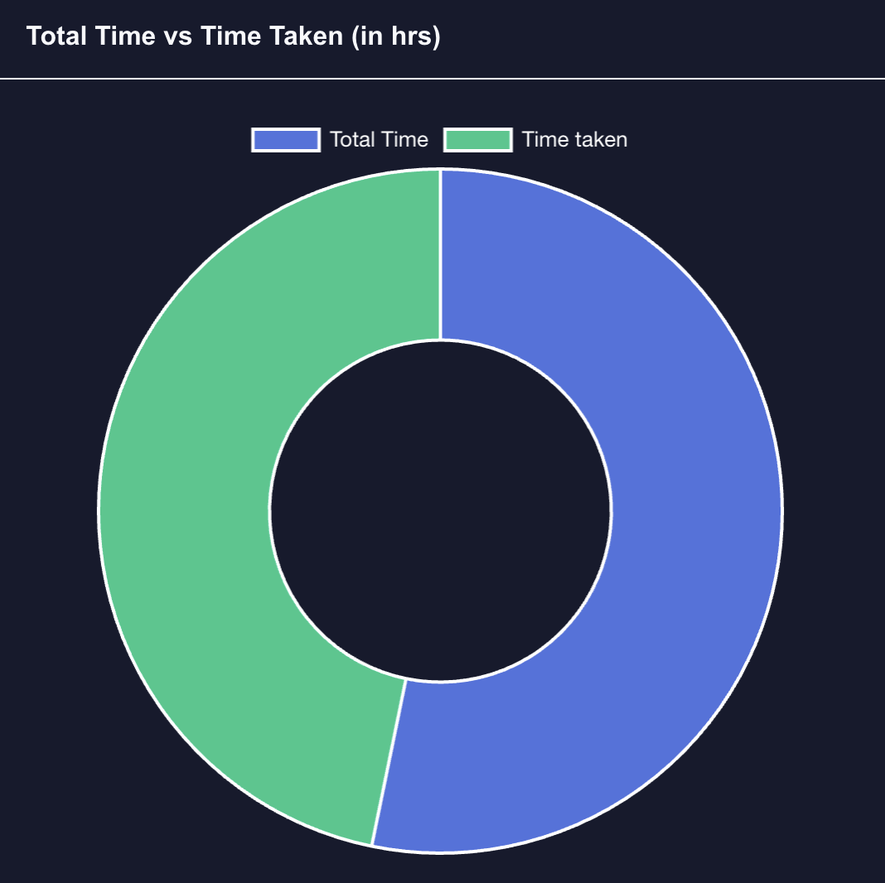
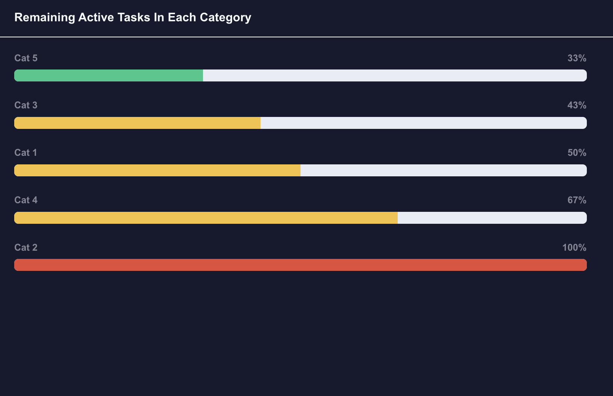
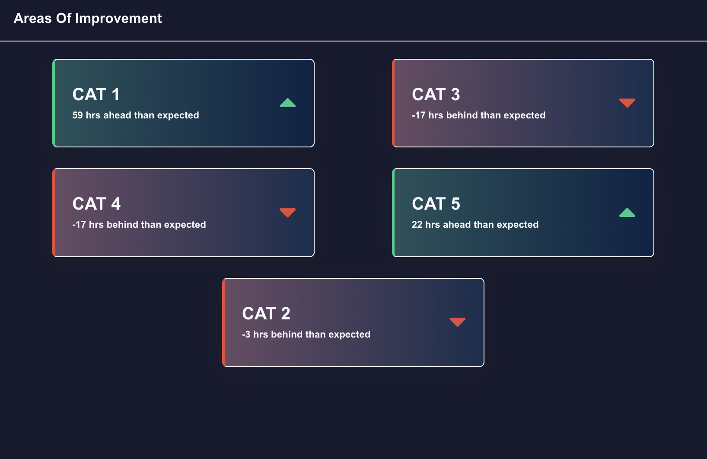

# Real-time Progress Monitoring
##### Team Name: rakshitkulkarni2002_Team
<br/>
A progress dashboard of tasks provides a visual representation of the status and progress of various tasks within a project or workflow. In any project or workflow, keeping track of task progress is crucial for ensuring timely completion. It helps an individual identify bottlenecks, prioritize the work, track performance, and enhance continuous improvement.

## Dataset

Created a dataset in JSON format by assuming that the data of the user already exists.

 tasks<Array>:  [<br/>
 name<String>,<br/>
 category<String>,<br/>
 timeTaken<Number>,<br/>
 avgTimeRequired<Number>,<br/>
 status<String>,<br/>
 improvementNeeded<String>,<br/>
 ]<br/>


Here, a task is a key that accepts an array as a value. The array contains mainly these fields,
- ###### [name]: Task name.
- ###### [category]: The task belongs to which category
- ###### [timeTaken]: How much time a user have taken to complete or yet to complete the task.
- ###### [avgTimeRequired]: The actual time required to complete the task which has already been set by the admin.
- ###### [status]: The status of the task which is completed or not completed in the form of “YES” and “NO” respectively.
- ###### [imrovementNeeded]: In this field, we have to calculate based on timeTaken and avgTimeRequired fields, i.e. if avgTimeRequired > timetaken this field will be set to “YES” or else “NO”.

## Features

The dashboard contains a nav bar where we will see the user detail at the top right corner, in the body of the page in the first row it mainly contains four widgets,
- [Total tasks]: Total Number of enrolled tasks.
- [Completed tasks]: Number of tasks whose status is “YES” which defines that task is completed.
- [Total time spent on tasks]: Sum of time taken to complete tasks or yet to complete.
- [Completed vs Total tasks]: It is a ratio of the number of completed tasks to total tasks.

<p align="center">
  
</p>

##### All tasks
It contains a table view that contains all tasks ( active and completed ) where fields in the dataset section are mapped to columns of the table. Color codes to identify tasks by status,
- Active tasks: white
- Completed tasks: light blue
- Tasks with Improvement needed (NO) mapped green and with (YES) mapped to red color for imrovementNeeded values in - the table.
- There is a search bar on the widget where we will be able to search for a particular task.

<p align="center">
  
</p>

#####  Pick up where you left off 
It helps users view the incompleted/active tasks. So a user will be able to navigate to the task by clicking on the view task button. This widget contains sub widgets where it has been categorized into three groups,
- Widget with background color green, left border color green and an icon caret up with green color background to  identify that time spent on a task is less than the time required to complete the task.
- Widget with background color red, left border color red, and an icon caret down with red color background to - identify that time spent on a task is greater than the time required to complete the task.
- Widget with background color green, left border color red, and an icon caret down with red color background to identify that time spent on a task is equal to the time required to complete the task.

<p align="center">
  
</p>

##### Time Spent On Tasks 
It is a graphical visualization of a line chart with two lines one is for time spent on tasks and another one for actual time required for the task.

<p align="center">
  
</p>

##### Total Time vs Time Taken (in hrs)
It is a graphical visualization of a donut chart with two parts one is for the sum of time spent on tasks and another one is for the sum of all actual time required for the task.

<p align="center">
  
</p>

##### Remaining Active Tasks In Each Category
The categories are sorted based on the values/percentage. Where the values represent how much percentage of the tasks are completed to enrolled tasks in that category. If it is 100% then no task is completed in that category. If the percentage is below 35 progress bar is filled with green, if it is between 35 to 70 then yellow, If it is above 70 then red. 

<p align="center">
  
</p>

##### Areas Of Improvement
This is the most important widget where a user will be able to see in which topic he/she is lacking. The representation of the widget contains nested widgets where each sub-widget has a category name and how many hours are behind or ahead of the expected time to complete all tasks in that category. If it is ahead then it distinguished as green color i.e. progress, if it is behind then red.

<p align="center">
  
</p>

## Installation

Real-time Progress Monitoring requires [Node.js](https://nodejs.org/) v10+ to run.

Clone the repository and Install the dependencies

```sh
git clone https://github.com/Rakshitkulkarni223/Real-Time-Progress-Monitoring.git
cd Real-Time-Progress-Monitoring
npm install
```
To start the server run this command
```sh
npm start
```
Server will run on this port i.e. 30000
```sh
http://localhost:3000/
```
